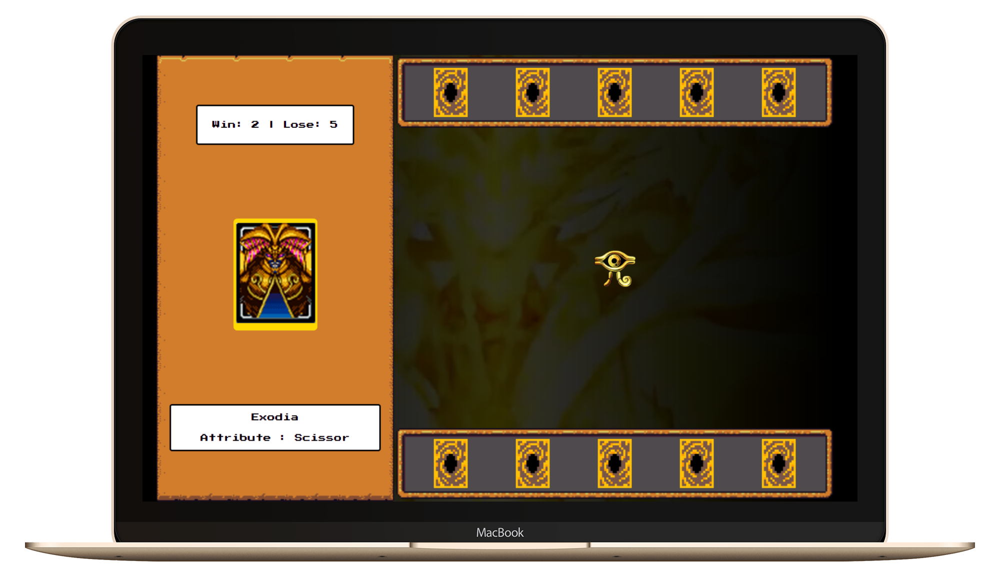

# Entrega de projeto - Criando um Jogo de Cartas do Yu-Gi-Oh! com JavaScript e CSS | DIO

Este projeto tem como objetivo recriar um jogo do Yu-Gi-Oh utilizando as mecânicas de jogo do Jo-Ken-Po (Pedra, Papel e Tesoura). Vamos explorar conceitos avançados de organização de states com JavaScript puro, estruturação de arquivos e criação de funções reaproveitáveis.

## Tecnologias Utilizadas

- HTML: Para estruturar o conteúdo do jogo.
- CSS: Para estilizar e melhorar a aparência do jogo.
- JavaScript: Para implementar a lógica do jogo, gerenciamento de estados e interatividade.

## Como Executar o Projeto

1. Clone o repositório:

   ```bash
   git clone https://github.com/fabiocasadossites/desafio-javascript-jogo-yugioh-dio.git
   ```

2. Navegue até o diretório do projeto:

   ```bash
   cd nome-do-repositorio
   ```

3. Abra o arquivo index.html

<br>

### Veja o projeto

[Link do projeto](https://fabiocasadossites.github.io/desafio-javascript-jogo-yugioh-dio/)


<br>

## 👨‍💻 Expert

<p>
    
    <p>&nbsp&nbsp&nbspFabio Augusto<br>
    &nbsp&nbsp&nbsp
    <a href="https://github.com/fabiocasadossites">
    GitHub</a>&nbsp;|&nbsp;
    <a href="https://www.linkedin.com/in/fabioasa/">LinkedIn</a>
&nbsp;|&nbsp;
    <a href="https://www.fabioaugusto.dev/">
    Portfolio </a>
&nbsp;&nbsp;</p>
</p>
<br/>
<p>

💻 com ❤️ por [Fabio Augusto](https://github.com/fabiocasadossites)
